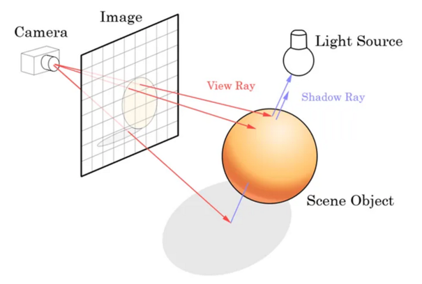

# CSCI596

# Path Tracer

Rendering realistic 3D scenes involves simulating the complex behavior of light as it interacts with surfaces and materials. The traditional rendering equation captures this phenomenon, but it's recursive nature makes it computationally intensive and challenging to solve directly, necessitating optimizations and numerical approximation methods like Monte Carlo. The planned objective of this project is to develop a high-performance Path Tracer in C++ to address the challenges of rendering 3D scenes. 
## Instructions to run

1. Install prerequisites (cmake)
2. Create build directory and navigate to it
3. cmake PATH_TO_SOURCE (eg: cmake /c/users/sneha/CSCI596/)
4. make
5. ./pathtracer num_samples (eg: ./pathtracer 5)

## 1. Problem & Solution
Rendering realistic 3D scenes involves simulating the complex behavior of light as it interacts with surfaces and materials. 
The traditional rendering equation captures this phenomenon, but it's recursive nature makes it challenging to solve directly, necessitating numerical approximation methods like Monte Carlo.
Path tracing is particularly effective in capturing realistic lighting scenarios, including effects like soft shadows, caustics, and color bleeding. However, it can be computationally intensive, and require optimizations

The planned objective of this project is to develop a high-performance Path Tracer in C++ to address the challenges of rendering 3D scenes. Path Tracing, a cutting-edge technique, will be employed to simulate light interactions accurately. The solution includes implementing robust ray tracing, advanced rendering features, and optimization for real-time rendering, catering to scientific computing and visualization needs.

## 2. Background
#### 2.1 What is a path tracer?
- A Path Tracer is a 3D rendering technique used in computer graphics to simulate the way light interacts with surfaces in a 3D scene. 
- It is a global illumination algorithm that models the realistic behavior of light by tracing the paths of light rays as they travel through a virtual environment. 
- The primary goal of path tracing is to produce visually realistic images by simulating the complex interactions of light with different surfaces, materials, and objects.
- Path tracers are used for creating photorealistic images and animations in applications such as film production, architectural visualization, and scientific visualization.

#### 2.2 Motivation
- Why Scientific Computing and Visualization?
-- Scientific Visualization: Accurate representation of complex scientific phenomena.
-- Monte Carlo Technique: Essential in scientific computing for numerical approximation.
- Why Path Tracer?
-- Realism in Visualization: Path Tracing provides a realistic approach for visualizing scientific data and simulations.
-- Photorealistic Rendering: Aids researchers in creating visually compelling images.

#### 2.3 Background and Mathematical Explanation

- Path Tracing and the Rendering Equation

The rendering process in computer graphics is mathematically represented by the rendering equation, which describes how light interacts with surfaces in a 3D scene. The equation is recursive and challenging to solve directly due to its lack of a base case. Instead, numerical approximation methods are required. The core idea is to sample the equation at various points, average the results, and converge to the mathematical expectation.

- Monte Carlo Approximation

To approximate the rendering equation, we use Monte Carlo approximation. Instead of sampling points directly, we employ heuristics to select "good points" where the equation provides more information. For instance, in the case of specular BRDF, we focus on the direction with the highest probability of occurrence. This approach balances accuracy with computational efficiency.

- Reformulated Rendering Equation

A key trick in Path Tracing is to reformulate the rendering equation to make it more manageable. The reformulated equation expresses the light sent out from a point as a sum of contributions from rays of increasing length. This formulation highlights the need to randomly generate ray paths and accumulate their contributions, with each ray path originating from the eye and terminating at a light source.

- Equations

In Computer Graphics, the rendering process is represented by the rendering equation:

$$L_o(x, w_o) = L_e(x, w_i) + \int f_r(x, w_i, w_o)L_i(x, w_i)(w_i.n)dw_i$$

It basically states that the amount of light sent out in direction $w_o$ from point x is the sum of the light emitted at the point and affected by the sum of the light received in all directions in that point.

The function $f_r(x, w_i, w_o)$ is the "Bidirectional Reflection Function". It governs how much of the light received at the point x from direction $w_i$ is sent out in direction $w_o$.

For example, the specular BRDF (aka perfect reflection) has $f_r(x, w_o, w_i) \neq 0$ only for one direction.

The key thing to understand here is that this equation is recursive.

$$L_i(x, w_i) = L_o(x', -w_i)$$

However, unlike the other nicely behaved recursive functions we're used to dealing with, this one has no base case. You can keep recursing infinitely: light sent out from a point is influenced by light sent out from all other points & light sent out at those other points also depend on all other points.

Thus, we cannot solve the equation directly and require numerical approximation methods. One common technique used is Monte Carlo approximation. 

The basic idea is to sample the equation at various points (i.e distinct values of $w_i$) and average them out.  The more the points, the closer our approximation is, since we'll converge to the mathematical expectation.

In practice, just sampling points directly is too noisy and we don't get useful images in any reasonable amount of time. This then enters the domain of various heuristics used to select "good points". We use information we know about the quantity being estimated. For instance, for the specular BRDF, we should not waste time sampling other directions since only one direction will have $f_r(x, w_o, w_i) \neq 0$. More generally, we want to sample points using parameters where the equation gives a larger value, i.e we want more accuracy for the points where we get more information (higher values) while trading off lower accuracy for other points.

For instance, in the rendering equation, the $w_i.n$ term expands to $|w_i| .| n |.cos \theta$. Thus sampling directions $w_i$ with a probability distribution being PDF($w_i) = cos(angle(n, w_i))$ is a reasonable idea.

There are also various other terms (such as the BRDF) in the equation which can also be used as a PDF. 

Another important trick is about reformulating the equation  in a way that is more easier to approximate:

$$L(p_1 -> p_0) = L_e(p_1 -> p_0) + \int L_e(p_2->p_1) f(p_2 -> p_1 -> p_0) dA(p2) + $$

$$\int \int L_e(p_3->p_2) f(p_3 -> p_2 -> p_1) dA(p2) \times f(p2 -> p1 -> p0) dA(p3)dA(p2) + \dots$$ 

 
 Put it simply, the reformulated equation states the light sent out from a point in terms of the sum of the contributions of rays of increasing length. The first term is a ray of length 0. The second term is the summation of contribution of rays of length 1 and so on. It is exactly the same quantity as the rendering equation, except this formulation helps us see that we need to randomly generate ray paths and add their contributions. Each ray path begins at the eye and ends at a light source.

The field of Path Tracing has a large focus on various tricks and techniques to make the approximation of the rendering equation tractable while producing images with as less noise as possible.

## 3.Aim

The project aims to achieve the following specific goals:

- Implement a robust and efficient Path Tracer capable of rendering complex 3D scenes.
- Simulate the global illumination process to accurately model how light interacts with surfaces and materials.
- Incorporate advanced rendering features, including ray intersection, reflection, refraction, and physically-based materials.
- Optimize the Path Tracer to provide real-time or interactive rendering capabilities for scientific visualization and computer graphics applications.
- Develop a user-friendly interface for defining scenes, materials, and rendering parameters.
- Generate high-quality, visually realistic images and animations suitable for scientific visualization and artistic applications.

## 4. Experiment Design and Implementation

The implementation phase of this project will incorporate the theoretical insights discussed above. The key steps will include:

- Implementation of a C++ program considering the recursive nature of the rendering equation.
- Integration of relevant libraries for geometry representation, shading, and acceleration.
- Monte Carlo Integration: Implementation for efficient sampling.
- Detailed Experimentation with path tracing

## 5. Evaluation

The project's success will be assessed through various evaluation criteria:

Visual Quality: Comparison against reference images to assess realism and accuracy.
Performance: Detailed analysis of rendering times for complex scenes and animations.
Feature Completeness: Support for various materials, camera models, and light sources.
Usability: Evaluation of the user interface for efficient scene and rendering parameter definition.
Code Quality: Review for maintainability, scalability, and adherence to best practices.

## 6. Results

1 Sample

4 Sample

16 Sample

## 7. Conclusion

The projects aimed to create a high-performance Path Tracer, aligning with scientific computing and visualization requirements. By achieving the outlined objectives and meeting evaluation criteria, the resulting tool will be valuable for in fields requiring accurate and visually compelling 3D renderings. 

Future work could involve further optimizations (Like : Metropolis Light Transport), additional rendering features (Like : bidirectional path tracing), and implementation and exploration of extensions like real-time interactive rendering.
